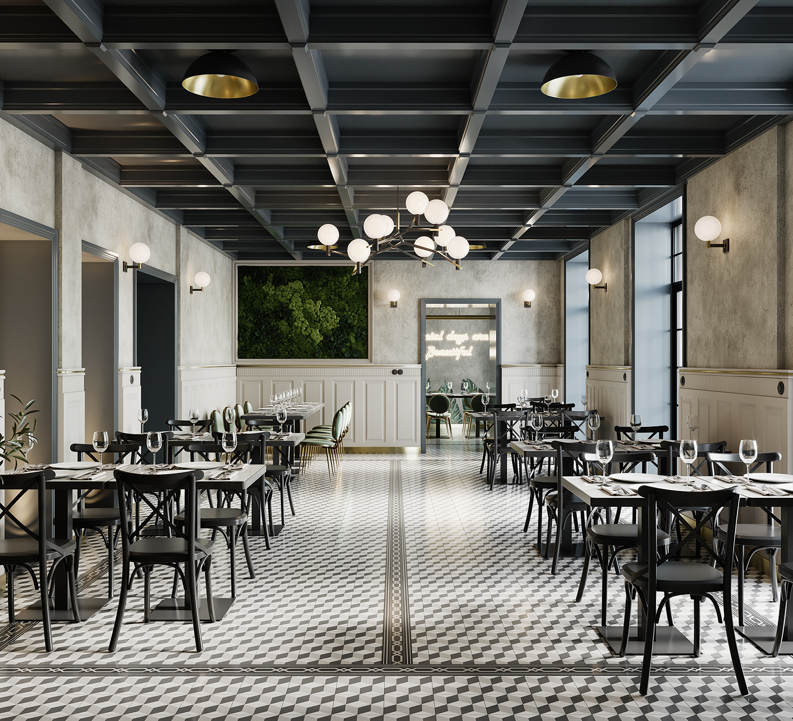

This project is a Machine Learning based web application that predicts the restaurant rating based on various features such as total votes, average cost for two people, price range, online delivery availability, and table booking facility.

The main goal of this project is to demonstrate how Decision Tree Regression can be used to solve a real-world prediction problem and how a trained machine learning model can be deployed as an interactive web application using Streamlit.

